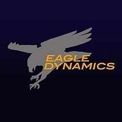
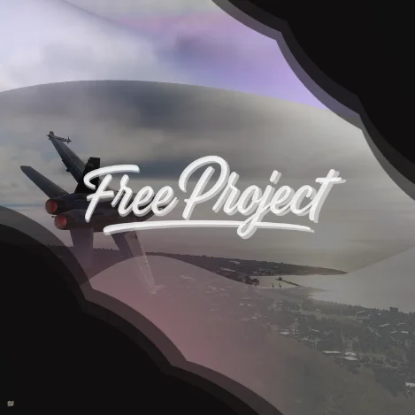

### Utiles link
- github ; https://github.com/FreeProject089/BetterModsManager
--
### 2 git branch ; main , Tdev
---
- main : stable version  ; https://github.com/FreeProject089/BetterModsManager/tree/main
- Tdev : test version  ; https://github.com/FreeProject089/BetterModsManager/tree/Tdev

---
acctual version ; V0.9.8FTB - {P U.4.LPU} 
Release date 2026-03-24 
-- download link 
nsis .exe download link ; https://github.com/FreeProject089/BetterModsManager/releases/download/LR/Better.Mod.Manager_0.9.8_x64-setup.exe
msi .msi download link ; https://github.com/FreeProject089/BetterModsManager/releases/download/LR/Better.Mod.Manager_0.9.8_x64_en-US.msi
source code ; https://github.com/FreeProject089/BetterModsManager/archive/refs/tags/LR.zip

- 
last release (auto update when new release is available); https://github.com/FreeProject089/BetterModsManager/releases/tag/LR

---
Credit dev video <video controls src="../videos/credits_bg.mp4" title="Gource visualization"></video>
-
Tasky masscot ; [../Tasky](../Tasky)   
---
main logo of BMM (Better Mod Manager) ;  
text version of the logo ; 
---
forums eagle dynamique (DCS) ; https://forum.dcs.world/topic/385941-better-modmanager/
ED logo ; 
---
Creator / Main Dev , PFP ;

---
License ; [ GPL 3.0](../../LICENSE.md)
EULA ; [English](../../EULA.md) [Français](../../EULA_FR.md)

---
all Release Note of BMM (with section ); [../../Update](../../Update) 
--

Next update ; V0.9.9 {RT1}
expected release date ; 01/05/2026 18h00 (Zurich time)
- avec un count down avent next update et un countdown depuis la sortie de la version précédente - 

--
siteweb host sur github static page , si besoin use github actions
--
